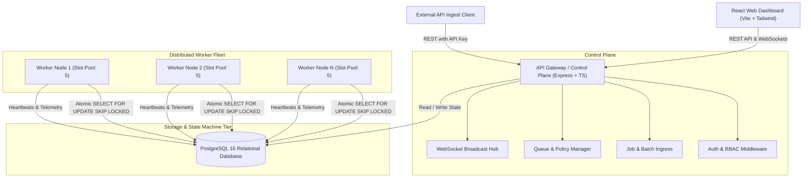
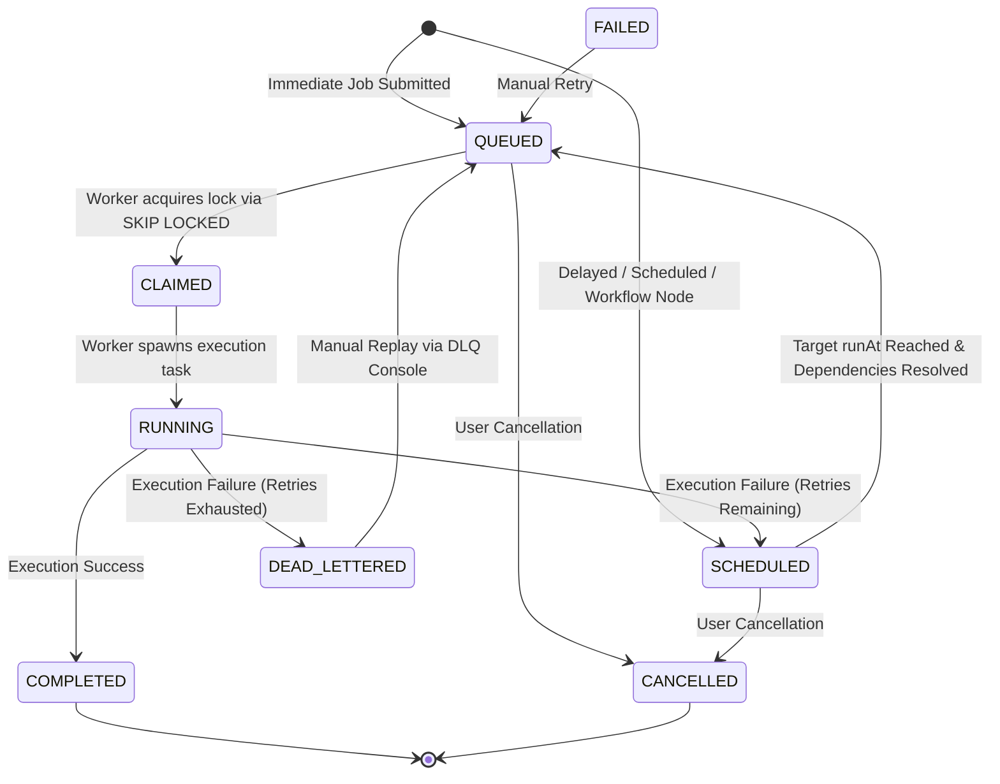
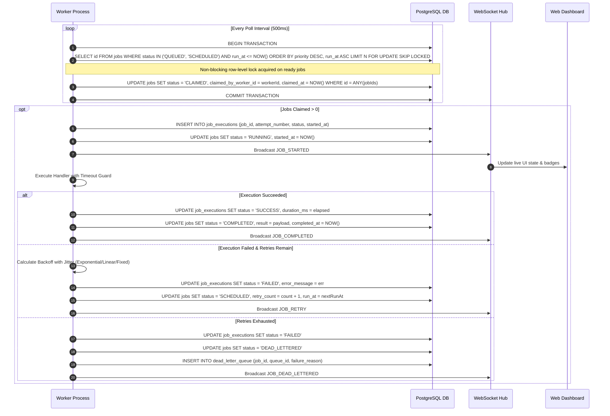

# System Architecture & Component Design

## 1. High-Level System Architecture

The Distributed Job Scheduling Platform is architected as a modular, decoupled distributed system consisting of four primary tiers:

1. **Presentation Tier (React Web Dashboard)**: Vite-powered single-page application providing real-time operational control, queue configuration, worker fleet monitoring, and log streaming over WebSockets.
2. **API & Control Plane Tier (Express Server)**: Stateless REST API gateway responsible for user authentication (JWT), machine authentication (API Keys), queue/job ingress, validation, and WebSocket broadcasting.
3. **Data Storage & Coordination Tier (PostgreSQL 16)**: Centralized relational persistence and state-coordination engine using transaction isolation and row-level locking (`FOR UPDATE SKIP LOCKED`).
4. **Distributed Worker Fleet Tier (Autonomous Worker Processes)**: Horizontally scalable worker nodes that poll queues, atomically acquire jobs, execute handlers concurrently within bounded slot pools, emit heartbeats, and handle graceful shutdown.

---

## 2. Distributed Job Lifecycle State Machine

Every background job transitions through a strictly validated finite state machine:

---

## 3. End-to-End Data Flow Sequence

### A. Atomic Claim & Execution Flow

---

## 4. Concurrency, Fault Tolerance & Worker Reaping

1. **Atomic Concurrency (`SKIP LOCKED`)**:
   - Multiple worker processes poll the same database table concurrently without blocking one another or incurring race conditions.
   - When Worker A locks Job 1, Worker B's transaction immediately skips Job 1 and acquires Job 2 in $O(1)$ index time.
2. **Heartbeat Telemetry**:
   - Workers emit a periodic heartbeat every 5 seconds recording timestamp, active slot load, CPU load, and memory usage.
3. **Dead Worker Reaper Daemon**:
   - A background daemon checks for worker nodes with no heartbeat for $>15$ seconds.
   - When a node is declared `DEAD`, any jobs stranded in `CLAIMED` or `RUNNING` state are automatically re-queued (or sent to DLQ if max retries were exhausted), guaranteeing zero abandoned jobs.
4. **Graceful Drain on Shutdown**:
   - On `SIGINT`/`SIGTERM`, workers stop accepting new claims, pause polling, allow in-flight promises up to 30 seconds to finish, deregister cleanly, and release unstarted claims.
