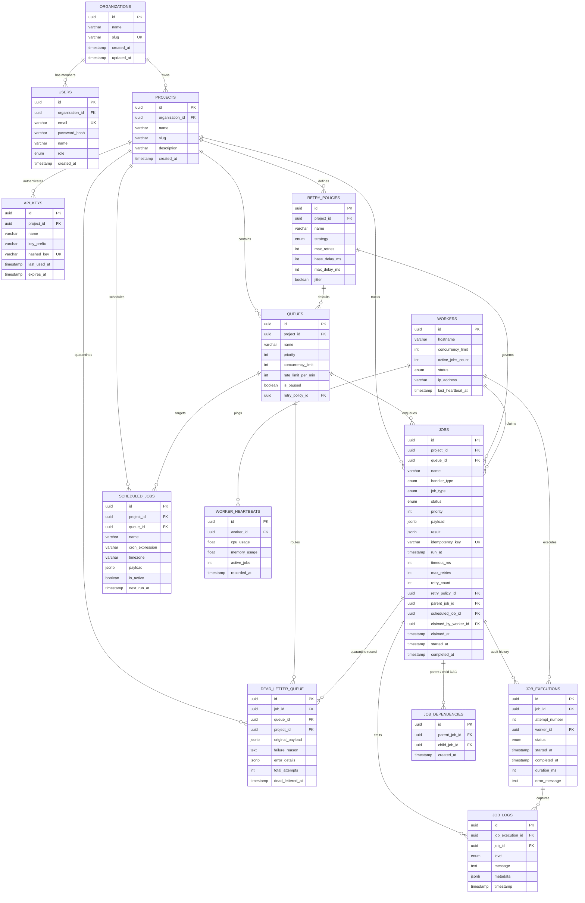

# Relational Database Design & Schema Specification

## 1. Entity-Relationship (ER) Diagram

The system employs a 3NF relational database schema modeled in PostgreSQL across **14 core entities**:

---

## 2. Normalization Analysis (3NF Compliance)

1. **First Normal Form (1NF)**:
   - All attributes are atomic. Payload and results use native JSONB documents for arbitrary unstructured parameters without repeating table columns.
   - Every entity has a strictly unique Primary Key (`UUIDv4`).
2. **Second Normal Form (2NF)**:
   - All non-key attributes are fully functionally dependent on the primary key.
   - For example, `job_executions` depends strictly on `id`, referencing `job_id` and `worker_id` via foreign keys rather than storing worker or job metadata redundantly.
3. **Third Normal Form (3NF)**:
   - No transitive dependencies exist.
   - Queue configurations, retry policy rules, user details, and organization bounds are normalized into dedicated relations.

---

## 3. Referential Integrity & Cascading Behavior

| Relationship | Foreign Key Constraint | Cascading Behavior | Rationale |
| :--- | :--- | :--- | :--- |
| `users` $\rightarrow$ `organizations` | `organization_id` | `ON DELETE CASCADE` | Removing a tenant organization cleanly purges its member accounts. |
| `projects` $\rightarrow$ `organizations` | `organization_id` | `ON DELETE CASCADE` | Removing a tenant organization removes all child projects. |
| `queues` $\rightarrow$ `projects` | `project_id` | `ON DELETE CASCADE` | Deleting a project cascades to its queues and jobs. |
| `jobs` $\rightarrow$ `queues` | `queue_id` | `ON DELETE CASCADE` | Deleting a queue cascades to its contained jobs. |
| `jobs` $\rightarrow$ `retry_policies` | `retry_policy_id` | `ON DELETE SET NULL` | Deleting a retry policy resets jobs to system default fallback without deleting the jobs. |
| `jobs` $\rightarrow$ `workers` | `claimed_by_worker_id` | `ON DELETE SET NULL` | If a worker record is deleted, claimed jobs have their worker reference cleared for reaper reclamation. |
| `job_executions` $\rightarrow$ `jobs` | `job_id` | `ON DELETE CASCADE` | Deleting a job cleanly purges its execution attempt audit logs. |
| `job_logs` $\rightarrow$ `job_executions` | `job_execution_id` | `ON DELETE CASCADE` | Deleting an execution attempt cascades to its log lines. |
| `job_dependencies` $\rightarrow$ `jobs` | `parent_job_id`, `child_job_id` | `ON DELETE CASCADE` | Deleting either parent or child removes the DAG dependency edge. |

---

## 4. Indexing Strategy & Performance Considerations

### Crucial Indices for Atomic Queue Claiming
1. **`jobs(queue_id, status, run_at, priority DESC)`**:
   - **Purpose**: Powers the high-frequency atomic worker claiming query (`SELECT ... FOR UPDATE SKIP LOCKED`).
   - **Optimization**: Avoids full table scans by matching the compound index on non-paused queues, ready statuses (`QUEUED`, `SCHEDULED`), due timestamps (`run_at <= NOW()`), and ordering by highest priority first.
2. **`jobs(project_id, idempotency_key)` [UNIQUE SPARSE]**:
   - **Purpose**: Fast $O(1)$ deduplication check ensuring at-most-once job creation per project.
3. **`worker_heartbeats(worker_id, recorded_at DESC)`**:
   - **Purpose**: Rapid worker liveness checks and CPU/Memory time-series queries.
4. **`job_executions(job_id, attempt_number)`**:
   - **Purpose**: Instant retrieval of attempt history and duration timeline in the Job Explorer drawer.
5. **`scheduled_jobs(is_active, next_run_at)`**:
   - **Purpose**: Allows the CronRunner daemon to scan only active recurring jobs due for execution.
