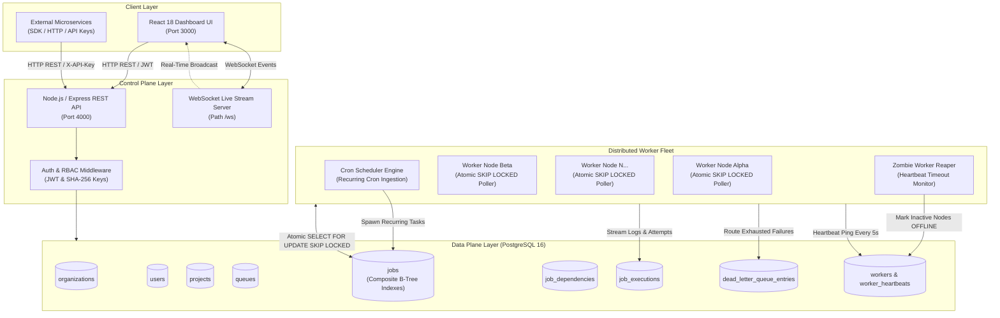

# Distributed Job Scheduling Platform: System Architecture

## 1. High-Level Architecture Overview

The Distributed Job Scheduler is an enterprise-grade, multi-tenant background task orchestrator designed to provide at-least-once task execution, dynamic priority scheduling, resilient retry policies with jitter, automated DAG dependency unblocking, Dead Letter Queue (DLQ) quarantine, and real-time observability across distributed worker nodes.



---

## 2. Core Subsystems

### A. Atomic Job Claiming Engine (`SELECT ... FOR UPDATE SKIP LOCKED`)
Traditional background queues (e.g. naive polling or non-locking reads) suffer from race conditions where two workers claim the same job simultaneously, or lock the entire table causing throughput bottlenecks.

Our poller executes an atomic transaction with explicit row-level locking:
```sql
SELECT id FROM jobs
WHERE "queueId" = $1
  AND status = 'QUEUED'
  AND "runAt" <= NOW()
ORDER BY priority DESC, "runAt" ASC
LIMIT $2
FOR UPDATE SKIP LOCKED;
```
- **`FOR UPDATE`**: Locks the claimed rows exclusively.
- **`SKIP LOCKED`**: Other concurrent worker threads bypass locked rows instantly without waiting or encountering deadlocks, ensuring disjoint task claims across high-concurrency worker clusters.

---

### B. DAG Workflow Dependency Resolution
Jobs can have upstream prerequisite dependencies declared in `job_dependencies`. 
1. Downstream workflow jobs enter the system in `SCHEDULED` status.
2. When an upstream parent job transitions to `COMPLETED`, the worker executor queries all dependent child jobs.
3. Once all parent jobs for a child are marked `COMPLETED`, the child is automatically unlocked into `QUEUED` status and claimed by the next available worker.

---

### C. Configurable Retry Policies with Full Jitter
When a task encounters an unhandled exception or network timeout:
1. The executor evaluates the queue's configured `RetryPolicy`:
   - **Fixed**: $D = \text{interval}$
   - **Linear**: $D = \text{interval} \times \text{attempt}$
   - **Exponential with Jitter**: $D = \min(\text{initial} \times \text{multiplier}^{\text{attempt}-1}, \text{max}) \times (0.75 + \text{random} \times 0.5)$
2. Full jitter prevents the **Thundering Herd problem**, spreading re-attempts uniformly across time.
3. If attempts exceed `maxRetries`, the job is quarantined into the **Dead Letter Queue (DLQ)** with the complete failure reason and stack trace.

---

### D. Distributed Worker Fleet Telemetry & Zombie Reaper
- Each worker node sends a heartbeat ping every 5 seconds to `worker_heartbeats`, reporting its hostname, process ID, concurrency limit, active job count, CPU utilization, and memory usage.
- An automated background **Zombie Reaper** continuously inspects workers. Any worker whose heartbeat is older than 15 seconds is marked `OFFLINE`, and its claimed in-flight jobs are recovered back to `QUEUED` status for other healthy workers to claim.
