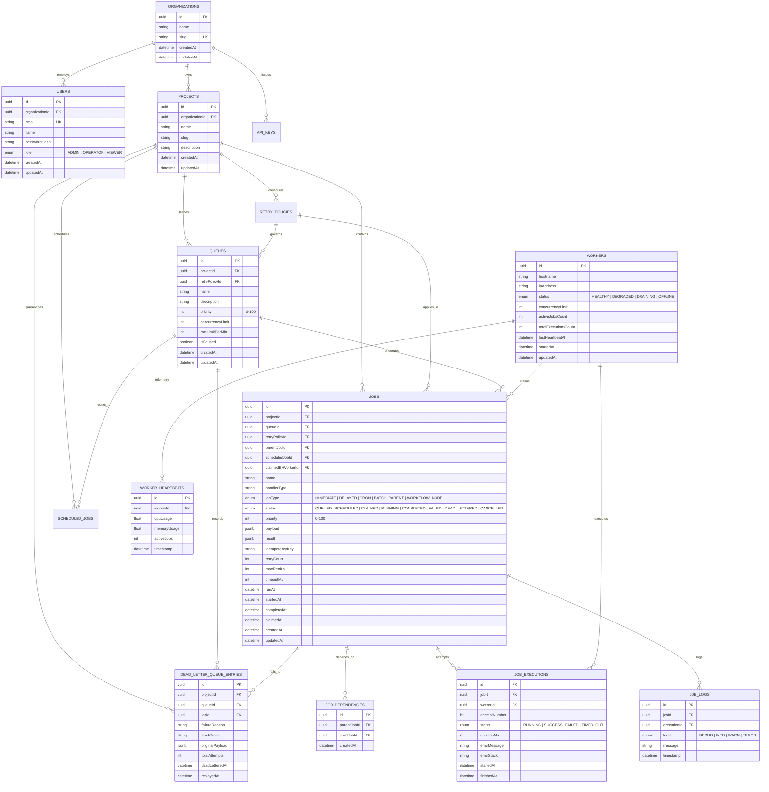

# Database Schema & Entity-Relationship Design

## 1. Entity-Relationship (ER) Diagram

The platform utilizes a 14-entity relational schema in PostgreSQL designed to Third Normal Form (3NF), guaranteeing data integrity, multi-tenant isolation, and high-concurrency indexing.



---

## 2. Indexing Strategy & Concurrency Performance

### The Critical Poller Index:
```prisma
@@index([queueId, status, runAt, priority(sort: Desc)])
```
- **Why It Matters**: The worker poller queries:
  ```sql
  WHERE "queueId" = $1 AND status = 'QUEUED' AND "runAt" <= NOW() ORDER BY priority DESC, "runAt" ASC
  ```
  Without this composite B-Tree index, PostgreSQL would execute a full table scan across millions of historical jobs on every tick. This index narrows the search space to $O(\log N)$ and evaluates the `FOR UPDATE SKIP LOCKED` filter in sub-millisecond execution time.

### Idempotency Index:
```prisma
@@index([projectId, idempotencyKey])
```
- Ensures fast $O(1)$ duplicate checking within the 24-hour retention window.

### Multi-Tenant Organization Isolation:
- Every tenant boundary has a foreign key to `Organization` and `Project` with composite unique constraints (`@@unique([organizationId, slug])`) preventing cross-tenant name collisions and data leakage.
